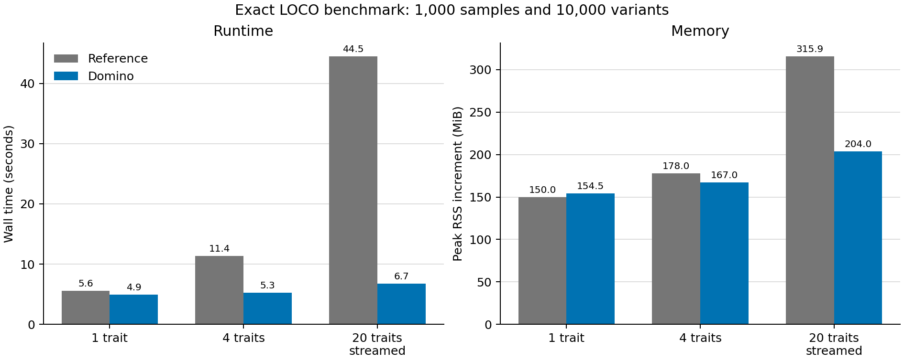

# Domino optimization benchmark

## Summary

On the recorded 1,000-sample, 10,000-variant PLINK dataset with one BLAS
thread, Domino completed one trait in 4.94 seconds, four traits in 5.28
seconds, and 20 streamed traits in 6.75 seconds with a cold exact-LOCO cache.
The 20-trait cache-hit run completed in 3.75 seconds. Relative to the preserved
pre-optimization reference, these correspond to 1.13x, 2.16x, 6.60x, and
11.87x speedups, respectively.

## Measurements

| Implementation | Traits | Output | Runtime (s) | Peak RSS increment (MiB) |
|---|---:|---|---:|---:|
| Reference baseline | 1 | Retained | 5.598 | 150.0 |
| Domino | 1 | Retained | 4.944 | 154.5 |
| Reference baseline | 4 | Retained | 11.374 | 178.0 |
| Domino | 4 | Retained | 5.276 | 167.0 |
| Reference baseline | 20 | Streamed | 44.531 | 315.9 |
| Domino, cold cache | 20 | Streamed | 6.745 | 204.0 |
| Domino, cache hit | 20 | Streamed | 3.750 | 170.4 |

For the 20-trait cold-cache run, sampled incremental RSS decreased by 35.4%.
With a cache hit, it decreased by 46.1%. Single-trait incremental RSS changed
little because retained pandas output and common exact-GRM work dominate this
small workload.

## Numerical comparison

The exact optimized path and the frozen pre-optimization reference were
compared across 200,000 variant-trait rows. Every primary numeric field met
`rtol=1e-10` and `atol=1e-10`; genotype-filter, dominance-class, and
inheritance-label agreement was 100%. The largest absolute difference among
reported joint raw effects was `4.67e-12`.

## 50,000-sample planning dry run

With a 56 GiB process budget, initial randomized rank 1,000, adaptive-rank cap
4,000, float32, ten covariates, an 8,192-variant block ceiling, and ten million
variants, the planner estimated a 13.6 GiB peak for 100 traits with an 8,192
marker block. It estimated 6.2 GiB for 1,000 traits with a 1,000-marker block,
where the one-million-row output-block cap reduced the selected block size.
Projected complete long-format outputs were approximately 65 GiB and 652 GiB.

These are allocation estimates. They are not measured 50,000-sample memory
peaks, runtime guarantees, or evidence of statistical calibration at rank
4,000.

## Reproducibility and limitations

The timing benchmark used Python 3.13.9, 1,000 samples, 10,000 variants across
five chromosomes, exact float64 decomposition, profile REML, null Gaussian
traits generated with seed 8712, one BLAS thread, and 10 ms RSS sampling. Each
configuration was timed once, so no replicate-derived uncertainty interval is
available.

CUDA was not measured in this environment. Randomized LOCO, SCORE, float32,
multivariate analysis, and CUDA need separate numerical-concordance, type I
error, and power qualification for a target production design.
